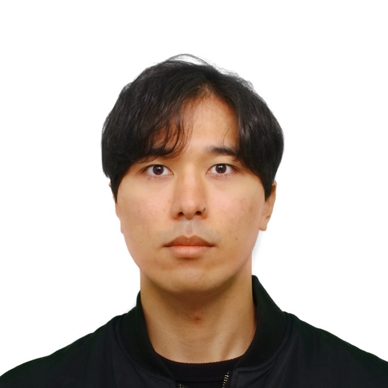

# KAZUMA IKEDA (池田 和真)

Contact: [kazu2080@keio.jp](mailto:kazu2080@keio.jp)

## Education

- 4/1/2026 - Present: Doctoral course, [Yoshioka Laboratory](https://sites.google.com/keio.jp/keio-csg/home), Department of Integrated Design Engineering, [Graduate School of Science and Technology, Keio University](https://www.st.keio.ac.jp/departments/design/)
- 4/1/2024 - 3/31/2026: Master's course, [Yoshioka Laboratory](https://sites.google.com/keio.jp/keio-csg/home), Department of Integrated Design Engineering, [Graduate School of Science and Technology, Keio University](https://www.st.keio.ac.jp/departments/design/)
- 4/1/2020 - 3/31/2024: [Faculty of Science and Technology, Keio University](https://www.st.keio.ac.jp/)
- 4/1/2017 - 3/31/2020: [Keio Senior High School](https://www.hs.keio.ac.jp/)

## Technical Skills

- **Programming:** C++, Python, TypeScript, JavaScript
- **Robotics / AV:** ROS/ROS2, LiDAR, GNSS, sensor calibration, time synchronization
- **Perception / CV:** 3D point clouds, object detection, tracking, dataset construction
- **Tools:** Linux, Git, Docker, PyTorch

## Publications

- K. Ikeda, Y. Hayakawa, R. Suzuki, S. Nagai, O. Sako, R. Nagata, R. Yoshida and K. Yoshioka, "Optical LiDAR Communication: Repurposing Existing LiDAR Sensors for Infrastructure-to-Vehicle Communication", IEEE Robotics and Automation Letters, 2025.
- Y. Hayakawa*, T. Sato*, R. Suzuki*, K. Ikeda, O. Sako, R. Nagata, R. Yoshida, Q. Chen, K. Yoshioka, "Breaking the Shield: Systematic Security Analysis on Pulse Fingerprinting LiDAR Systems for Autonomous Driving", IEEE Sensors Journal, 2025.
- R. Suzuki*, T. Sato*, Y. Hayakawa*, K. Ikeda, O. Sako, R. Nagata, R. Yoshida, Q. Chen, K. Yoshioka, "From Lab to Road: Realizing and Detecting LiDAR Spoofing Attacks against Autonomous Vehicles at High-Speed and Long-Distance", IEEE Sensors Journal, 2025.

## Conferences

- K. Ikeda*, R. Hara*, R. Nagata, O. Sako, Z. Ding, T. Kado, I. Fujioka, T. Beppu, M. Isogawa, K. Yoshioka, "Ghost-FWL: A Large-Scale Full-Waveform LiDAR Dataset for Ghost Detection and Removal", Conference on Computer Vision and Pattern Recognition (CVPR), 2026.
- T. Sato*, R. Suzuki*, Y. Hayakawa*, K. Ikeda, O. Sako, R. Nagata, R. Yoshida, Q. Chen, K. Yoshioka, "On the Realism of LiDAR Spoofing Attacks against Autonomous Driving Vehicle at High Speed and Long Distance", Network and Distributed System Security Symposium (NDSS), 2025.
- R. Nagata, K. Koide, Y. Hayakawa, R. Suzuki, K. Ikeda, O. Sako, Q. Chen, T. Sato, and K. Yoshioka, "SLAMSpoof: Practical LiDAR Spoofing Attacks on Localization Systems Guided by Scan Matching Vulnerability Analysis", IEEE International Conference on Robotics and Automation (ICRA), 2025.
- R. Hayashi, K. Torimi, R. Nagata, K. Ikeda, O. Sako, T. Nakamura, M. Tani, Y. Aoki, K. Yoshioka, "BasketLiDAR: The First LiDAR-Camera Multimodal Dataset for Professional Basketball MOT", MMSports, 2025.
- R. Yoshida, T. Sato, Y. Hayakawa, R. Suzuki, K. Ikeda, O. Sako, R. Nagata, K. Yoshioka, "Poster: Discovering Sensor-Fusion-Vulnerabilities in autonomous driving systems against LiDAR attacks", Network and Distributed System Security Symposium (NDSS), Poster Session, 2025.
- K. Ikeda, Y. Hayakawa, R. Suzuki, O. Sako, R. Nagata, K. Yoshioka, "A Proposal for a Novel Infrastructure Sensing System Using LiDAR Sensor Spoofing Attacks (LiDARセンサ幻惑攻撃を用いた新たなインフラセンシングシステムの提案)", The 30th Symposium on Image Sensing (SSII), Pacifico Yokohama, Yokohama, June 12, 2024.
- O. Sako, T. Sato, R. Suzuki, Y. Hayakawa, K. Ikeda, R. Nagata, Q. A. Chen, K. Yoshioka, "Proposal and Demonstration of Intensity-Spoofing Arbitrary-Shape LiDAR Sensor Attacks (LiDARセンサに対する強度偽装型任意形状センサ幻惑攻撃の提案および実証)", The 30th Symposium on Image Sensing (SSII), Pacifico Yokohama, Yokohama, June 12, 2024.
- R. Nagata, T. Sato, R. Suzuki, Y. Hayakawa, K. Ikeda, O. Sako, Q. A. Chen, K. Yoshioka, "Evaluation of Relay-Type Sensor Spoofing Attacks Against LiDAR-Based Localization (LiDARベース自己位置推定に対するrelay型センサ幻惑攻撃の評価)", The 30th Symposium on Image Sensing (SSII), Pacifico Yokohama, Yokohama, June 12, 2024.
- R. Hayashi, R. Nagata, K. Ikeda, O. Sako, T. Nakamura, M. Tani, K. Yoshioka, "Proposal and Evaluation of a LiDAR-Based Tracking System for Basketball (LiDARを用いたバスケットボール向けトラッキングシステムの提案と検証)", SSII 2025, Pacifico Yokohama, Yokohama, May 28, 2025.

## Research & Industry Experience

### Research Assistant, [Yoshioka Laboratory](https://sites.google.com/keio.jp/keio-csg/home), [Graduate School of Science and Technology, Keio University](https://www.st.keio.ac.jp/departments/design/)

Apr. 2025 - Present

- Conduct research on LiDAR sensing, autonomous driving, and sensor security.
- Develop experimental systems, collect and analyze sensor data, and evaluate LiDAR-based perception methods.

### Part-Time Software Engineer, Tier IV

Apr. 2024 - Apr. 2025

- Developed LiDAR sensor drivers for autonomous driving systems.
- Implemented GNSS-based time synchronization for accurate multi-sensor data alignment.
